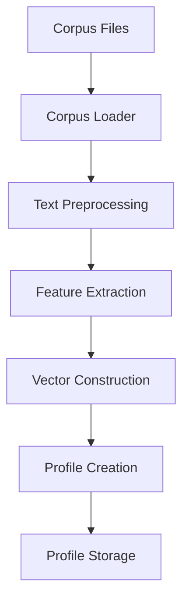
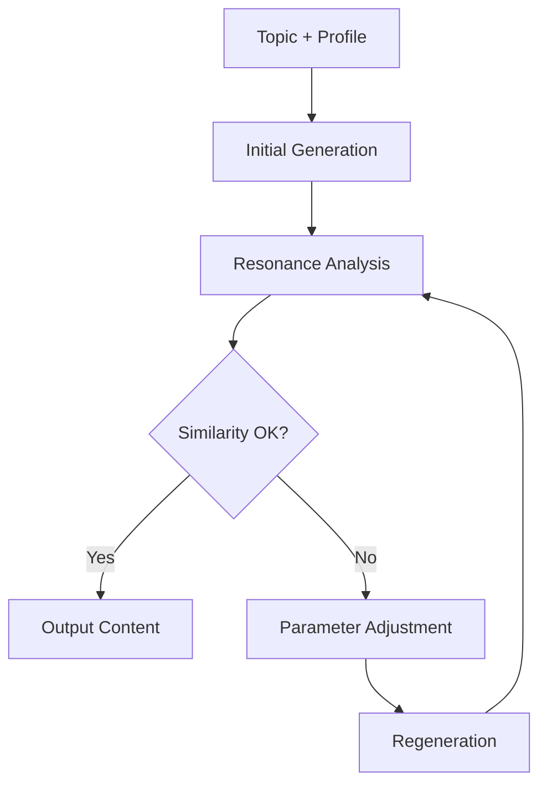
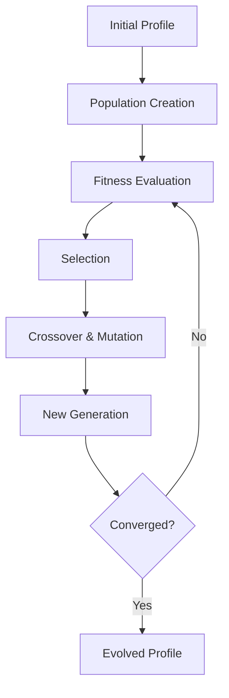

# ResonanceOS Architecture Guide

## System Overview

ResonanceOS is an advanced AI system that learns stylistic resonance from writers and generates original content with real-time tonal alignment. The system uses a sophisticated 9-layer architecture to ensure high-quality, stylistically consistent content generation.

## Core Architecture

```
Input Corpus → Resonance Profiler → Style Vector Encoder → Adaptive Generator 
→ Resonance Feedback Controller → Drift Detector → Reinforcement Optimizer 
→ Output Article + Resonance Score
```

## Module Architecture

### Core Module (`resonance_os.core`)

The foundation layer providing configuration, types, and utilities:

- **`constants.py`**: System constants, resonance dimensions, default values
- **`config.py`**: Configuration management with environment variable support
- **`types.py`**: Pydantic models for type safety and validation
- **`logging.py`**: Structured logging with performance tracking

### Profiling Engine (`resonance_os.profiling`)

Handles style analysis and profile creation:

- **`corpus_loader.py`**: Multi-format text corpus loading and preprocessing
- **`style_vector_builder.py`**: Multi-tier resonance vector extraction
- **`profile_persistence.py`**: Profile storage, backup, and management

#### Tiers of Analysis

1. **Tier 1**: Basic statistical features (TextBlob, regex)
2. **Tier 2**: Advanced linguistic features (spaCy)
3. **Tier 3**: Transformer embeddings (HuggingFace)

### Similarity Engine (`resonance_os.similarity`)

Computes style similarity and detects drift:

- **`metrics.py`**: Multi-method similarity calculation (cosine, euclidean, etc.)
- **`drift.py`**: Real-time drift detection and analysis

#### Similarity Methods

- **Cosine Similarity**: Vector angle-based similarity
- **Euclidean Distance**: Geometric distance in vector space
- **Manhattan Distance**: L1 norm distance
- **Pearson Correlation**: Linear correlation coefficient
- **Spearman Correlation**: Rank-based correlation

### Generation Engine (`resonance_os.generation`)

Adaptive text generation with real-time feedback:

- **`parameter_controller.py`**: Dynamic parameter adjustment based on feedback
- **`adaptive_writer.py`**: Main generation engine with feedback loops

#### Generation Process

1. **Initial Generation**: Create content using current parameters
2. **Resonance Analysis**: Measure similarity to target style
3. **Feedback Calculation**: Determine if correction needed
4. **Parameter Adjustment**: Modify generation parameters
5. **Regeneration**: Generate corrected content if needed

### Evolution System (`resonance_os.evolution`)

Optimizes profiles using evolutionary algorithms:

- **`reward_model.py`**: Multi-objective reward calculation
- **`tone_evolver.py`**: Genetic algorithm-based profile evolution

#### Evolution Strategies

- **Genetic Algorithm**: Crossover and mutation-based optimization
- **Particle Swarm Optimization**: Swarm intelligence approach
- **Simulated Annealing**: Probabilistic optimization
- **Bayesian Optimization**: Model-based optimization

### API Layer (`resonance_os.api`)

RESTful API for external integration:

- **`fastapi_server.py`**: Main FastAPI application
- **`endpoints.py`**: API route definitions

#### API Endpoints

- **Profile Management**: Create, read, update, delete profiles
- **Generation**: Text generation with style alignment
- **Analysis**: Similarity calculation and comparison
- **Evolution**: Profile optimization
- **System**: Health checks and statistics

### CLI Interface (`resonance_os.cli`)

Command-line interface for system interaction:

- **`main.py`**: Click-based CLI with rich output

#### CLI Commands

- **`profile`**: Create and manage style profiles
- **`generate`**: Generate text with style alignment
- **`compare`**: Compare profile similarities
- **`evolve`**: Optimize profiles
- **`serve`**: Start API server
- **`stats`**: System statistics

## Resonance Vector Architecture

### Dimensions

The resonance vector captures 10 key stylistic dimensions:

1. **Lexical Density**: Ratio of content words to total words
2. **Emotional Valence**: Sentiment polarity (-1 to 1)
3. **Cadence Variability**: Sentence length variation
4. **Sentence Entropy**: Structural complexity
5. **Metaphor Frequency**: Figurative language usage
6. **Abstraction Level**: Conceptual vs. concrete language
7. **Assertiveness Score**: Confidence and directness
8. **Rhythm Signature**: Sentence flow patterns
9. **Narrative Intensity Curve**: Story progression
10. **Cognitive Load Index**: Reading complexity

### Vector Construction

```python
# Example resonance vector
resonance_vector = {
    "values": [0.85, 0.78, 0.72, 0.68, 0.75, 0.82, 0.79, 0.71, 0.77, 0.73],
    "dimensions": ["lexical_density", "emotional_valence", ...],
    "confidence": 0.92
}
```

## Feedback Loop Architecture

### Real-Time Feedback

The system implements a continuous feedback loop during generation:

1. **Content Generation**: Produce text segment
2. **Vector Extraction**: Analyze generated text
3. **Similarity Calculation**: Compare to target profile
4. **Drift Detection**: Monitor style deviation
5. **Parameter Adjustment**: Modify generation parameters
6. **Correction**: Regenerate if needed

### Parameter Control

The parameter controller adjusts multiple generation parameters:

- **Temperature**: Creativity vs. predictability
- **Top-P**: Nucleus sampling threshold
- **Presence Penalty**: Repetition control
- **Frequency Penalty**: Token frequency control
- **Sentence Length Bias**: Preferred sentence length
- **Emotional Weight**: Sentiment intensity
- **Vocabulary Constraint**: Word choice restrictions
- **Cadence Template**: Rhythm patterns

## Data Flow Architecture

### Profile Creation Flow



### Generation Flow



### Evolution Flow



## Performance Architecture

### Caching Strategy

- **Profile Cache**: In-memory profile storage
- **Vector Cache**: Computed resonance vectors
- **Model Cache**: Loaded NLP models
- **Result Cache**: Generation results

### Scalability Design

- **Async Processing**: Non-blocking I/O operations
- **Batch Processing**: Handle multiple requests efficiently
- **Resource Pooling**: Reuse expensive resources
- **Load Balancing**: Distribute processing load

### Monitoring Architecture

- **Performance Metrics**: Generation time, similarity scores
- **System Health**: Resource usage, error rates
- **User Analytics**: Profile usage, generation patterns
- **Quality Metrics**: Content quality assessments

## Security Architecture

### Data Protection

- **API Key Management**: Secure credential storage
- **Data Encryption**: Sensitive data protection
- **Access Control**: User authentication and authorization
- **Audit Logging**: Comprehensive activity tracking

### Ethical Safeguards

- **Content Filtering**: Prevent inappropriate content
- **Plagiarism Detection**: Ensure originality
- **Style Attribution**: Proper credit for source styles
- **Usage Limits**: Prevent abuse

## Integration Architecture

### External APIs

- **OpenAI GPT**: Primary text generation
- **HuggingFace**: Alternative models and embeddings
- **spaCy**: Linguistic analysis
- **TextBlob**: Sentiment analysis

### Database Integration

- **Profile Storage**: JSON and pickle formats
- **Generation History**: Track all generations
- **User Data**: Secure user information storage
- **Analytics Data**: Performance metrics

### File System Integration

- **Corpus Loading**: Multi-format support
- **Profile Export**: Backup and sharing
- **Log Management**: Structured log files
- **Configuration Files**: Environment-based config

## Deployment Architecture

### Development Environment

- **Local Development**: Docker containers
- **Testing**: Automated test suites
- **Documentation**: Auto-generated API docs
- **Code Quality**: Linting and formatting

### Production Deployment

- **Container Orchestration**: Kubernetes/Docker Swarm
- **Load Balancing**: Multiple API instances
- **Database Clustering**: High availability storage
- **Monitoring**: Application and infrastructure monitoring

### CI/CD Pipeline

- **Automated Testing**: Unit, integration, and end-to-end tests
- **Code Quality**: Automated code analysis
- **Security Scanning**: Vulnerability detection
- **Deployment**: Automated deployment pipelines

## Future Architecture

### Planned Enhancements

1. **Transformer Fine-Tuning**: Custom model training
2. **Contrastive Learning**: Style-topic separation
3. **Multi-Modal Input**: Image and text analysis
4. **Real-Time Collaboration**: Multi-user editing
5. **Advanced Analytics**: Deep learning insights

### Scalability Improvements

1. **Distributed Processing**: Parallel generation
2. **Edge Computing**: Local processing capabilities
3. **Model Optimization**: Quantization and pruning
4. **Caching Layers**: Multi-level caching strategy

### Integration Expansion

1. **Third-Party APIs**: Additional model providers
2. **Plugin System**: Extensible architecture
3. **Webhooks**: Event-driven integrations
4. **SDK Development**: Client libraries

This architecture provides a robust, scalable foundation for advanced stylistic text generation with real-time feedback and optimization capabilities.
